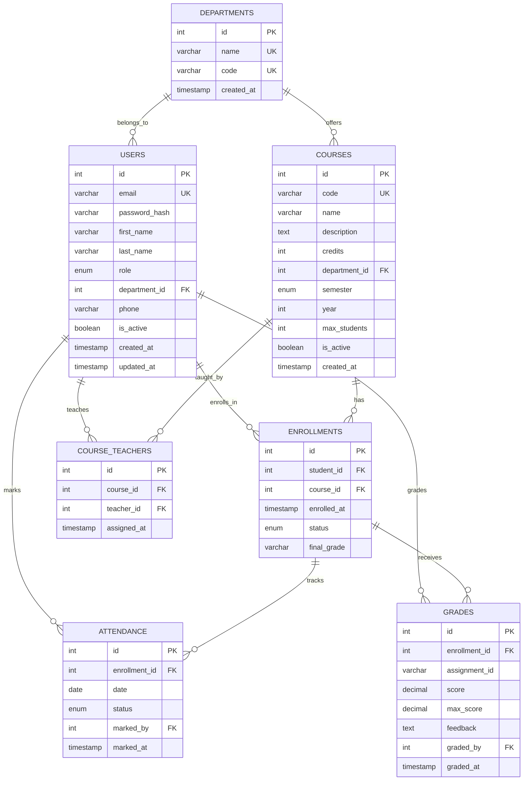

# LMS Project Review Components
**Learning Management System - Database Review**  
**Date:** February 12, 2026  
**Focus:** SQL Database (MySQL)

---

## 1. Requirement Analysis & Details of MySQL (5 Marks)

### Project Overview
The **EduNex Learning Management System** is a full-stack web application designed for educational institutions to manage courses, students, teachers, and academic activities efficiently.

### Why MySQL?
MySQL was chosen as the primary relational database for the following reasons:

#### ✅ Structured Data Requirements
- **User Management**: Students, teachers, and admins with fixed schemas
- **Course Management**: Courses, enrollments, and prerequisites
- **Academic Records**: Grades, attendance with strict data integrity
- **Referential Integrity**: Foreign key relationships between users, courses, and enrollments

#### ✅ ACID Compliance
- **Atomicity**: Enrollment transactions must be all-or-nothing
- **Consistency**: Grade calculations must maintain data integrity
- **Isolation**: Concurrent user operations must not interfere
- **Durability**: Academic records must persist reliably

#### ✅ Complex Queries & Joins
- Multi-table joins for student dashboards
- Aggregations for performance analytics
- Subqueries for enrollment validation
- Views for role-based data access

#### ✅ Data Normalization
- Schema normalized to **3rd Normal Form (3NF)**
- Eliminates data redundancy
- Ensures update anomaly prevention
- Maintains data consistency

### Database Requirements

#### Functional Requirements
1. **User Management**
   - Store user credentials securely (bcrypt hashed passwords)
   - Support multiple roles: student, teacher, admin
   - Track user activity and timestamps

2. **Course Management**
   - Store course information (code, name, credits, semester)
   - Assign teachers to courses (many-to-many relationship)
   - Track course capacity and enrollment limits

3. **Enrollment System**
   - Enroll students in courses
   - Validate enrollment capacity
   - Track enrollment status (active, completed, dropped)
   - Store final grades

4. **Attendance Tracking**
   - Record daily attendance (present, absent, late)
   - Link attendance to specific enrollments
   - Track who marked the attendance

5. **Grading System**
   - Store assignment grades
   - Link to MongoDB assignments via ObjectId
   - Track grader and timestamp

#### Non-Functional Requirements
1. **Performance**: Indexed queries for fast retrieval
2. **Scalability**: Support for thousands of users
3. **Security**: Role-based access control
4. **Reliability**: Backup and recovery mechanisms
5. **Maintainability**: Clean, normalized schema

---

## 2. ER Diagram (5 Marks)

### Entity-Relationship Model



### Entity Descriptions

| Entity | Description | Key Attributes |
|--------|-------------|----------------|
| **DEPARTMENTS** | Academic departments | name, code |
| **USERS** | All system users (students, teachers, admins) | email, role, password_hash |
| **COURSES** | Course offerings | code, name, credits, semester |
| **COURSE_TEACHERS** | Teacher-course assignments | course_id, teacher_id |
| **ENROLLMENTS** | Student course enrollments | student_id, course_id, status |
| **ATTENDANCE** | Daily attendance records | enrollment_id, date, status |
| **GRADES** | Assignment grades | enrollment_id, assignment_id, score |

### Relationship Cardinalities

- **DEPARTMENTS ↔ USERS**: One-to-Many (1:N)
- **DEPARTMENTS ↔ COURSES**: One-to-Many (1:N)
- **USERS ↔ ENROLLMENTS**: One-to-Many (1:N) - Students
- **COURSES ↔ ENROLLMENTS**: One-to-Many (1:N)
- **USERS ↔ COURSE_TEACHERS**: Many-to-Many (M:N) - Teachers
- **COURSES ↔ COURSE_TEACHERS**: Many-to-Many (M:N)
- **ENROLLMENTS ↔ ATTENDANCE**: One-to-Many (1:N)
- **ENROLLMENTS ↔ GRADES**: One-to-Many (1:N)

---

## 3. Schema Design (5 Marks)

### Normalization Analysis

#### 1st Normal Form (1NF)
✅ **Achieved**
- All attributes contain atomic values
- No repeating groups
- Each column contains single value
- Primary keys defined for all tables

#### 2nd Normal Form (2NF)
✅ **Achieved**
- All tables in 1NF
- No partial dependencies
- All non-key attributes fully dependent on primary key
- Example: `course_teachers` separates many-to-many relationship

#### 3rd Normal Form (3NF)
✅ **Achieved**
- All tables in 2NF
- No transitive dependencies
- Example: Department information separated from users table
- `department_id` references `departments` table instead of storing department name in users

### Schema Features

#### Primary Keys
- All tables have `AUTO_INCREMENT` integer primary keys
- Ensures unique identification of records

#### Foreign Keys
- Enforce referential integrity
- `ON DELETE CASCADE` for dependent records
- `ON DELETE SET NULL` for optional relationships

#### Unique Constraints
- `users.email` - Prevents duplicate accounts
- `courses.code` - Ensures unique course codes
- `departments.code` - Unique department identifiers
- Composite unique keys for enrollment and course-teacher assignments

#### Indexes
```sql
-- Performance optimization indexes
CREATE INDEX idx_users_email ON users(email);
CREATE INDEX idx_users_role ON users(role);
CREATE INDEX idx_courses_department ON courses(department_id);
CREATE INDEX idx_enrollments_student ON enrollments(student_id);
CREATE INDEX idx_enrollments_course ON enrollments(course_id);
CREATE INDEX idx_attendance_date ON attendance(date);
CREATE INDEX idx_grades_assignment ON grades(assignment_id);
```

#### Data Types
- `INT` for IDs and counts
- `VARCHAR` for text with length limits
- `TEXT` for long descriptions
- `ENUM` for fixed choices (role, status, semester)
- `DECIMAL(5,2)` for precise grade calculations
- `TIMESTAMP` for audit trails
- `BOOLEAN` for flags

---

## 4. Implementation & Queries (10 Marks)

### Database Setup

#### Create Database
```sql
CREATE DATABASE IF NOT EXISTS lms_db;
USE lms_db;
```

#### Sample Implementation Queries

##### 1. Student Enrollment with Validation
```sql
-- Check course capacity before enrollment
SELECT 
    c.name,
    c.max_students,
    COUNT(e.id) as current_enrollment,
    (c.max_students - COUNT(e.id)) as available_seats
FROM courses c
LEFT JOIN enrollments e ON c.id = e.course_id AND e.status = 'active'
WHERE c.id = 1
GROUP BY c.id, c.name, c.max_students;
```

##### 2. Student Performance Dashboard
```sql
-- Get comprehensive student performance
SELECT 
    u.first_name,
    u.last_name,
    c.code,
    c.name as course_name,
    COUNT(DISTINCT a.id) as total_classes,
    SUM(CASE WHEN a.status = 'present' THEN 1 ELSE 0 END) as classes_attended,
    ROUND(SUM(CASE WHEN a.status = 'present' THEN 1 ELSE 0 END) * 100.0 / COUNT(DISTINCT a.id), 2) as attendance_percentage,
    AVG(g.score / g.max_score * 100) as average_grade
FROM users u
JOIN enrollments e ON u.id = e.student_id
JOIN courses c ON e.course_id = c.id
LEFT JOIN attendance a ON e.id = a.enrollment_id
LEFT JOIN grades g ON e.id = g.enrollment_id
WHERE u.id = 5 AND e.status = 'active'
GROUP BY u.id, u.first_name, u.last_name, c.id, c.code, c.name;
```

##### 3. Teacher Course Load
```sql
-- Get teacher's teaching load and student count
SELECT 
    u.first_name,
    u.last_name,
    c.code,
    c.name,
    COUNT(DISTINCT e.student_id) as enrolled_students,
    c.max_students,
    ROUND(COUNT(DISTINCT e.student_id) * 100.0 / c.max_students, 2) as capacity_percentage
FROM users u
JOIN course_teachers ct ON u.id = ct.teacher_id
JOIN courses c ON ct.course_id = c.id
LEFT JOIN enrollments e ON c.id = e.course_id AND e.status = 'active'
WHERE u.role = 'teacher'
GROUP BY u.id, u.first_name, u.last_name, c.id, c.code, c.name, c.max_students;
```

##### 4. Department-wise Analytics
```sql
-- Department performance overview
SELECT 
    d.name as department,
    COUNT(DISTINCT CASE WHEN u.role = 'student' THEN u.id END) as total_students,
    COUNT(DISTINCT CASE WHEN u.role = 'teacher' THEN u.id END) as total_teachers,
    COUNT(DISTINCT c.id) as total_courses,
    COUNT(DISTINCT e.id) as total_enrollments
FROM departments d
LEFT JOIN users u ON d.id = u.department_id
LEFT JOIN courses c ON d.id = c.department_id
LEFT JOIN enrollments e ON c.id = e.course_id AND e.status = 'active'
GROUP BY d.id, d.name;
```

### Views Implementation

#### Student Dashboard View
```sql
CREATE VIEW student_dashboard AS
SELECT 
    u.id AS student_id,
    u.first_name,
    u.last_name,
    COUNT(DISTINCT e.id) AS enrolled_courses,
    COUNT(DISTINCT CASE WHEN a.status = 'present' THEN a.id END) AS total_present,
    COUNT(DISTINCT a.id) AS total_classes,
    ROUND(AVG(g.score / g.max_score * 100), 2) AS average_grade
FROM users u
LEFT JOIN enrollments e ON u.id = e.student_id AND e.status = 'active'
LEFT JOIN attendance a ON e.id = a.enrollment_id
LEFT JOIN grades g ON e.id = g.enrollment_id
WHERE u.role = 'student'
GROUP BY u.id, u.first_name, u.last_name;
```

### Stored Procedures

#### Enroll Student Procedure
```sql
DELIMITER //
CREATE PROCEDURE EnrollStudent(
    IN p_student_id INT,
    IN p_course_id INT,
    OUT p_result VARCHAR(100)
)
BEGIN
    DECLARE v_current_count INT;
    DECLARE v_max_students INT;
    DECLARE v_already_enrolled INT;
    
    -- Check if already enrolled
    SELECT COUNT(*) INTO v_already_enrolled 
    FROM enrollments 
    WHERE student_id = p_student_id AND course_id = p_course_id;
    
    IF v_already_enrolled > 0 THEN
        SET p_result = 'Already enrolled in this course';
    ELSE
        -- Check capacity
        SELECT COUNT(*) INTO v_current_count 
        FROM enrollments 
        WHERE course_id = p_course_id AND status = 'active';
        
        SELECT max_students INTO v_max_students 
        FROM courses 
        WHERE id = p_course_id;
        
        IF v_current_count >= v_max_students THEN
            SET p_result = 'Course is full';
        ELSE
            INSERT INTO enrollments (student_id, course_id) 
            VALUES (p_student_id, p_course_id);
            SET p_result = 'Enrolled successfully';
        END IF;
    END IF;
END //
DELIMITER ;
```

### Triggers

#### Update User Timestamp
```sql
DELIMITER //
CREATE TRIGGER update_user_timestamp
BEFORE UPDATE ON users
FOR EACH ROW
BEGIN
    SET NEW.updated_at = CURRENT_TIMESTAMP;
END //
DELIMITER ;
```

---

## 5. UI Design (10 Marks)

### Design System

#### Color Palette
- **Primary Blue**: `#3B82F6` - Main brand color
- **Dark Blue**: `#1E40AF` - Headers and emphasis
- **Light Blue**: `#DBEAFE` - Backgrounds
- **White**: `#FFFFFF` - Cards and surfaces
- **Gray Scale**: `#F9FAFB`, `#E5E7EB`, `#6B7280`

#### Typography
- **Primary Font**: Inter (Google Fonts)
- **Secondary Font**: Poppins (Headers)
- **Font Sizes**: 12px - 48px scale

#### Components
1. **Navigation Sidebar**
   - Role-based menu items
   - Active state indicators
   - User profile section

2. **Dashboard Cards**
   - Glassmorphic design
   - Hover animations
   - Icon integration

3. **Data Tables**
   - Sortable columns
   - Pagination
   - Search functionality

4. **Forms**
   - Input validation
   - Error messages
   - Success feedback

### User Interfaces

#### Student Dashboard
- Enrolled courses overview
- Attendance percentage
- Grade summary
- Upcoming assignments
- Notifications panel

#### Teacher Dashboard
- Teaching courses list
- Student roster
- Assignment management
- Grade submission interface
- Attendance marking

#### Admin Dashboard
- System analytics
- User management
- Course management
- Department overview
- System logs

---

## 6. Connectivity (5 Marks)

### Backend Architecture

#### Technology Stack
- **Runtime**: Node.js
- **Framework**: Express.js
- **MySQL Driver**: mysql2 (with promise support)
- **MongoDB Driver**: Mongoose
- **Authentication**: JWT (jsonwebtoken)
- **Password Hashing**: bcryptjs

#### Database Connection

##### MySQL Connection Pool
```javascript
// config/database.js
const mysql = require('mysql2/promise');

const mysqlPool = mysql.createPool({
    host: process.env.MYSQL_HOST || 'localhost',
    user: process.env.MYSQL_USER || 'root',
    password: process.env.MYSQL_PASSWORD,
    database: process.env.MYSQL_DATABASE || 'lms_db',
    waitForConnections: true,
    connectionLimit: 10,
    queueLimit: 0
});

module.exports = { mysqlPool };
```

##### MongoDB Connection
```javascript
// config/database.js
const mongoose = require('mongoose');

const connectMongoDB = async () => {
    try {
        await mongoose.connect(process.env.MONGODB_URI);
        console.log('MongoDB connected successfully');
    } catch (error) {
        console.error('MongoDB connection error:', error);
        process.exit(1);
    }
};

module.exports = { connectMongoDB };
```

### API Endpoints

#### Authentication Routes
```
POST /api/auth/register - Register new user
POST /api/auth/login - User login
GET /api/auth/me - Get current user
```

#### Student Routes
```
GET /api/student/dashboard - Student dashboard data
GET /api/student/courses - Enrolled courses
GET /api/student/attendance/:courseId - Course attendance
GET /api/student/grades/:courseId - Course grades
POST /api/student/enroll - Enroll in course
```

#### Teacher Routes
```
GET /api/teacher/dashboard - Teacher dashboard data
GET /api/teacher/courses - Teaching courses
GET /api/teacher/students/:courseId - Course students
POST /api/teacher/attendance - Mark attendance
POST /api/teacher/grade - Submit grade
```

#### Admin Routes
```
GET /api/admin/analytics - System analytics
GET /api/admin/users - All users
POST /api/admin/user - Create user
PUT /api/admin/user/:id - Update user
DELETE /api/admin/user/:id - Delete user
GET /api/admin/courses - All courses
POST /api/admin/course - Create course
```

### Frontend Integration

#### Technology Stack
- **Framework**: React 18
- **Build Tool**: Vite
- **Routing**: React Router v6
- **HTTP Client**: Axios
- **State Management**: React Context API

#### API Service Layer
```javascript
// src/services/api.js
import axios from 'axios';

const API_BASE_URL = 'http://localhost:5000/api';

const api = axios.create({
    baseURL: API_BASE_URL,
    headers: {
        'Content-Type': 'application/json'
    }
});

// Add token to requests
api.interceptors.request.use(config => {
    const token = localStorage.getItem('token');
    if (token) {
        config.headers.Authorization = `Bearer ${token}`;
    }
    return config;
});

export default api;
```

### Security Implementation

#### JWT Authentication
- Token-based authentication
- Secure password hashing (bcrypt, 10 rounds)
- Protected routes with middleware
- Role-based access control

#### Input Validation
- Express-validator for request validation
- SQL injection prevention (parameterized queries)
- XSS protection (Helmet.js)
- CORS configuration

---

## Review Checklist

### ✅ Requirement Analysis (5 marks)
- [x] Clear justification for MySQL selection
- [x] Functional requirements documented
- [x] Non-functional requirements specified
- [x] ACID properties explained

### ✅ ER Diagram (5 marks)
- [x] All entities identified
- [x] Relationships with cardinalities
- [x] Attributes and keys specified
- [x] Professional Mermaid diagram

### ✅ Schema Design (5 marks)
- [x] Normalized to 3NF
- [x] Primary and foreign keys
- [x] Indexes for performance
- [x] Appropriate data types

### ✅ Implementation & Queries (10 marks)
- [x] Complex SELECT queries
- [x] JOINs across multiple tables
- [x] Aggregation functions
- [x] Views created
- [x] Stored procedures
- [x] Triggers implemented

### ✅ UI Design (10 marks)
- [x] Modern, professional design
- [x] Role-based interfaces
- [x] Responsive layouts
- [x] User-friendly navigation

### ✅ Connectivity (5 marks)
- [x] Backend API implemented
- [x] Database connections established
- [x] Frontend integration complete
- [x] Authentication & security

---

## Demo Credentials

### Admin
- **Email**: admin@lms.edu
- **Password**: admin123

### Teacher
- **Email**: dr.sharma@lms.edu
- **Password**: teacher123

### Student
- **Email**: arjun@student.lms.edu
- **Password**: student123

---

**Total: 40 Marks**
